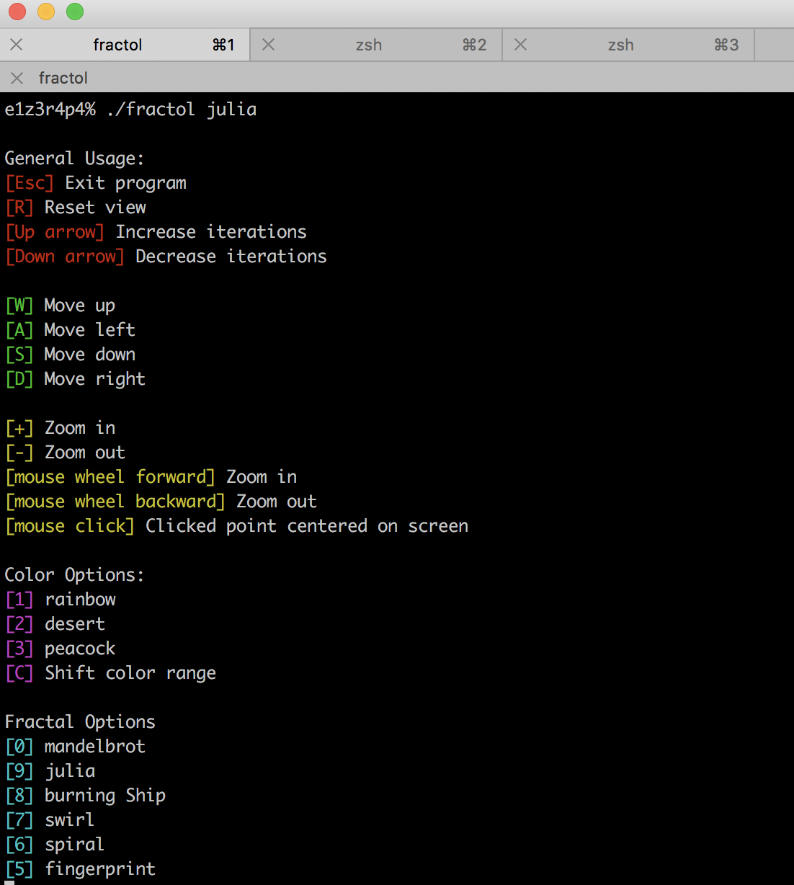
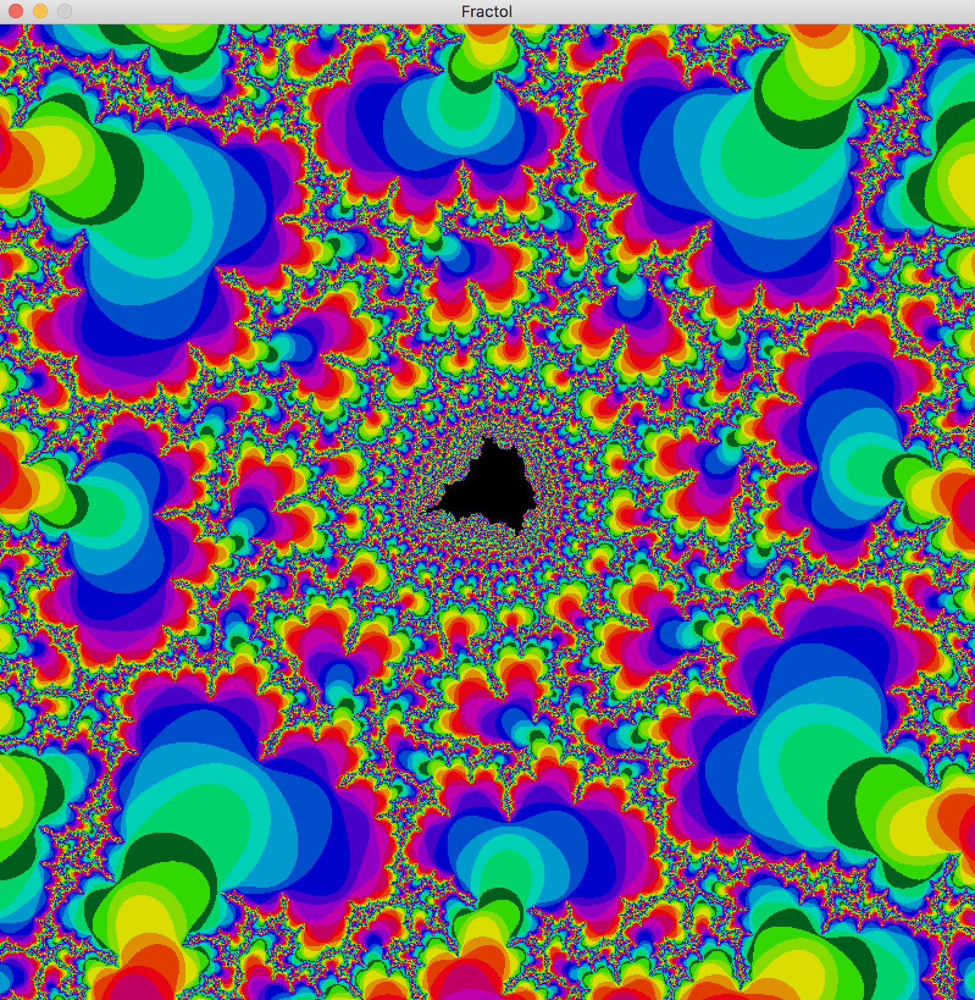
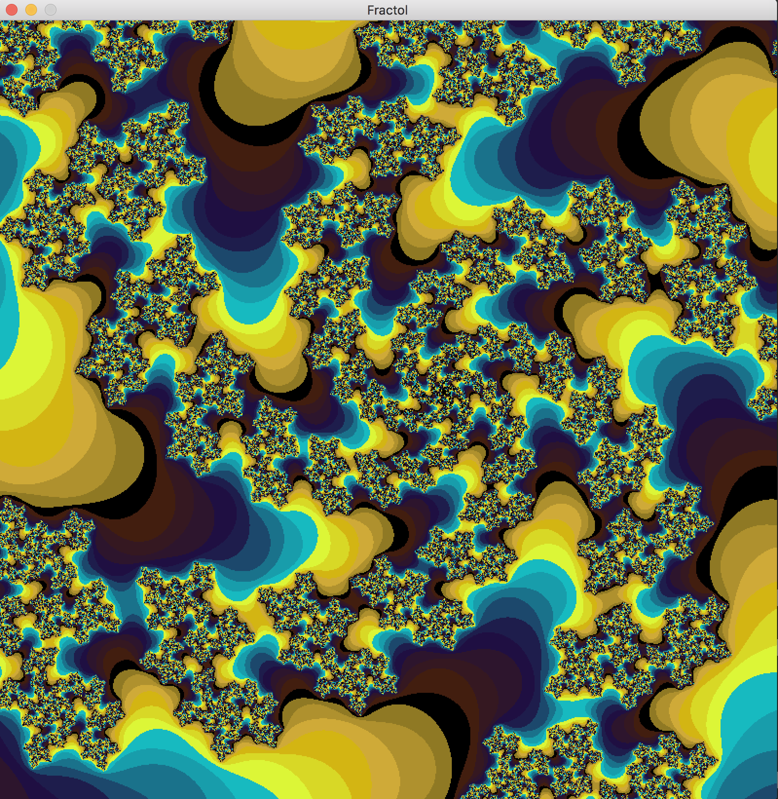
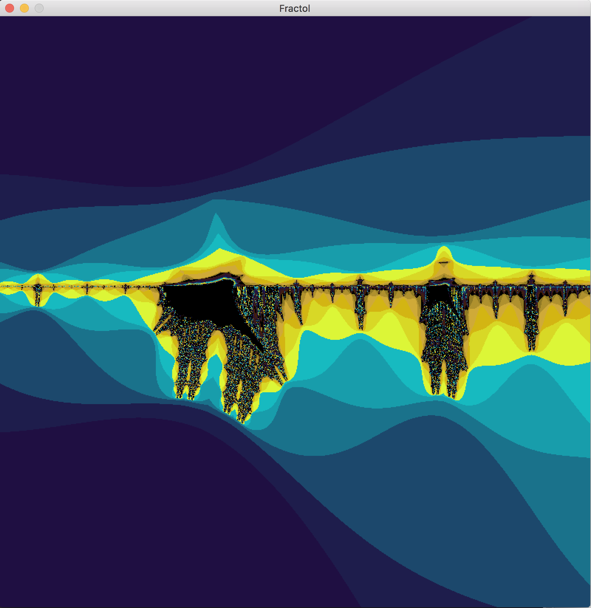

# 42 Project: Fract'ol

## Fract'ol

This program was made to explore fractals to the deepest level that the computer will allow (the limits of a double). Many fractals can be viewed at once, zooming and moving can occur at ant level, and many color schemes exist.

## Getting Started

### Compiling

Run the following commands:

* To compile
	- `make`
* To remove objects:
	- `make clean`
* To remove objects and binary file (program):
	- `make fclean`
* To re-compile:
	- `make re`

### Executing

To execute the program:

`./fractol <fractal> <fractal>

*Multiple fractals can be viewing and run simultaneously*

#### Try it!

Try running the following:

`./fractol mandelbrot`

`./fractol julia`

`./fractol burningship`

## Screenshots

**Usage:**

**Program running:**

